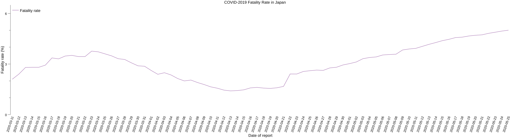

# 日本における COVID-2019 発症確認者のレポート

SARS-CoV-2 ウイルスによると見られる症状（COVID-2019）について整理しています。以下は WHO がパンデミック宣言を行った 2020-03-11 から緊急事態が解除された 2020-05-25 までの期間における日本国内での新規発症確認者をグラフ化したものです。

以下は同期間における日本における致命率（死亡率ではありません）の推移です。

更に以下は緊急事態が解除された 2020-05-25 以降における日本国内での新規発症確認者をグラフ化したものです。上の棒グラフとは縦軸のスケールが異なるので注意してください。

元になるデータは [WHO の situation report](https://www.who.int/emergencies/diseases/novel-coronavirus-2019/situation-reports "COVID-19 situation reports") より日本のデータを抜き出したものです。国内各地域のデータは（[situation report](https://www.who.int/emergencies/diseases/novel-coronavirus-2019/situation-reports "COVID-19 situation reports") にないため）ここにはありません。他をあたってください。

これらの情報はあくまで個人的な目的で作成したもので，データの正確性については保証しません（できません）し，これらを使って何かを主張するつもりもありません（私は医療関係者ではありません）ので，あらかじめご了承ください。
