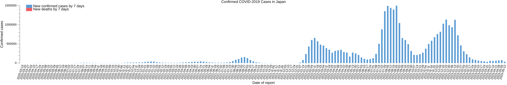
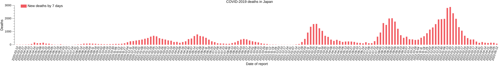

# 日本における COVID-2019 確認発症者のレポート

SARS-CoV-2 ウイルスによると見られる症状（COVID-2019）について整理しています。

WHO がパンデミック宣言を行った 2020-03-11 以降における国内の確認発症者数を7日毎に集計してグラフ化したものです。

以下は国内の新規死者数をグラフ化したものです。同じく7日毎の集計になっています。上のグラフとは縦軸のスケールが全く異なるので注意してください。あくまで推移を見るということで...

基となるデータは “[WHO Coronavirus Disease (COVID-19) Dashboard](https://covid19.who.int/)” から提供される CSV データを使っています。

- [`WHO-COVID-19-global-data.csv`](https://covid19.who.int/WHO-COVID-19-global-data.csv)

また，データの取得には拙作のパッケージを使用しています。

- [spiegel-im-spiegel/cov19data: Importing WHO COVID-2019 Cases Global Data](https://github.com/spiegel-im-spiegel/cov19data)

作成した情報はあくまで個人的な目的で作成したもので，データの正確性については保証しません（できません）し，これらを使って何かを主張するつもりもありません（私は医療関係者ではありません）ので，あらかじめご了承ください。

## 東京都のデータについて

東京都のデータは以下の Web ページから取得しています。

- [都内の最新感染動向 | 東京都 新型コロナウイルス感染症対策サイト](https://stopcovid19.metro.tokyo.lg.jp/)
    - [東京都 新型コロナウイルス陽性患者発表詳細 - データセット - 東京都オープンデータカタログサイト](https://catalog.data.metro.tokyo.lg.jp/dataset/t000010d0000000068)

東京都のデータは PCR 検査を行って陽性反応が出た人をカウントしているだけで WHO のデータとの整合性は考慮してません。あくまでも参考程度と考えてください。

## COVID-2019 関連のリンク集

- [Coronavirus Disease (COVID-19) Situation Reports](https://www.who.int/emergencies/diseases/novel-coronavirus-2019/situation-reports) : Situation Reports 週単位の報告（PDF）になった模様
- [Flatten the curve | These guidelines are intended to help Flatten the Curve with the COVID19 outbreak, to help limit spread and reduce the load on hospitals and other healthcare.](https://www.flattenthecurve.com/)
    - [ブログ: コロナウイルス(COVID-19)へのアドバイス](https://okuranagaimo.blogspot.com/2020/03/covid-19_11.html)
- [We're in for 2 months - foobuzz](https://foobuzz.github.io/covid19/)
    - [ブログ: 私たちには2ヶ月必要です](https://okuranagaimo.blogspot.com/2020/04/2.html)
- [Mysterious Heart Damage, Not Just Lung Troubles, Befalling COVID-19 Patients | Kaiser Health News](https://khn.org/news/mysterious-heart-damage-not-just-lung-troubles-befalling-covid-19-patients/)
    - [ブログ: COVID-19患者に降りかかる不思議な心臓の損傷](https://okuranagaimo.blogspot.com/2020/04/covid-19_7.html)
- [COVID-19: The T Cell Story - Articles](https://berthub.eu/articles/posts/covid-19-t-cells/)
    - [ブログ: COVID-19: T細胞の話](https://okuranagaimo.blogspot.com/2020/06/covid-19-t.html)
- [2020年7月1日ニュース「国内初のコロナワクチンの治験を開始 創薬ベンチャーの『アンジェス』」 | SciencePortal](https://scienceportal.jst.go.jp/news/newsflash_review/newsflash/2020/07/20200701_01.html)
- [MIT Tech Review: 新型コロナとインフルの似ているところ、違うところ＝WHO報告](https://www.technologyreview.jp/nl/these-are-6-of-the-main-differences-between-flu-and-coronavirus/)
- [New Data on T Cells and the Coronavirus  |  In the Pipeline](https://blogs.sciencemag.org/pipeline/archives/2020/07/15/new-data-on-t-cells-and-the-coronavirus)
    - [ブログ: T細胞とコロナウイルスに関する新しいデータ](https://okuranagaimo.blogspot.com/2020/07/t.html)
- [COVID-19（新型コロナウイルス感染症）に関する情報とリソース - Google](https://www.google.com/intl/ja_jp/covid19/)
- [Characteristics of SARS-CoV-2 and COVID-19 | Nature Reviews Microbiology](https://www.nature.com/articles/s41579-020-00459-7?error=cookies_not_supported&code=70d81179-79f2-4810-afd8-4e9f9b6d57db)
    - [ブログ: SARS-CoV-2とCOVID-19の特徴](https://okuranagaimo.blogspot.com/2020/10/sars-cov-2covid-19.html)
