# 日本版 Google COVID-19 Forecast データより

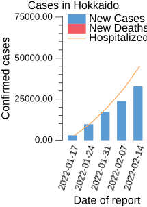

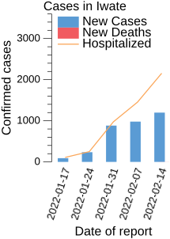
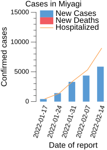
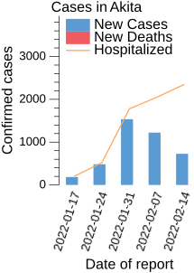
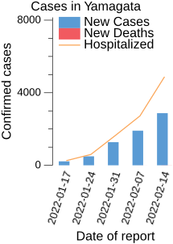
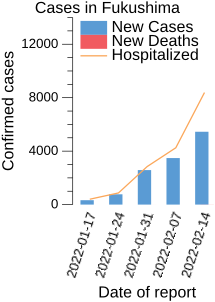
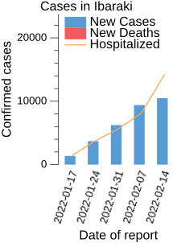
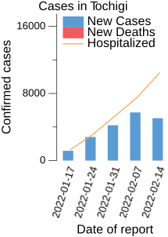
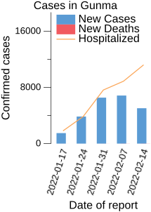
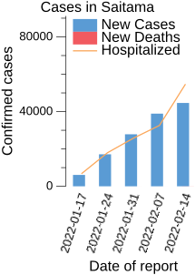
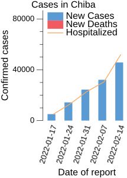
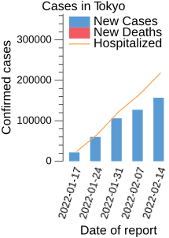
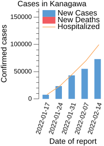
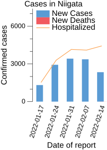
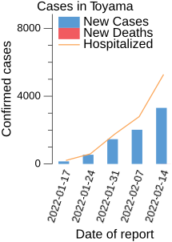
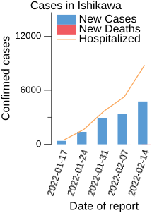

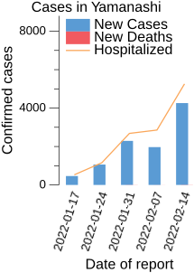
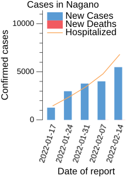
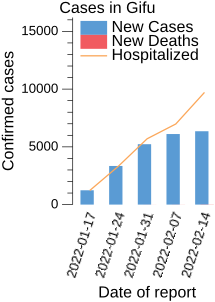
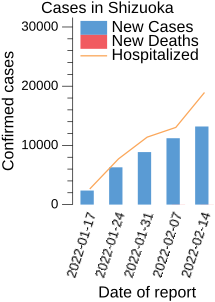
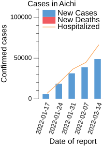
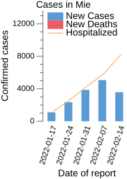

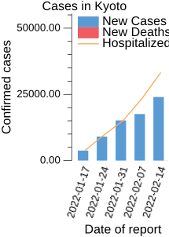
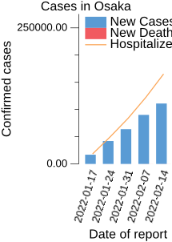
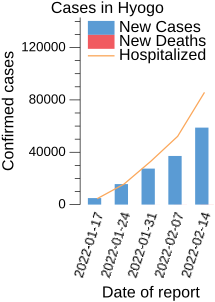
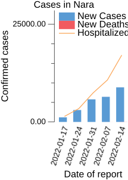
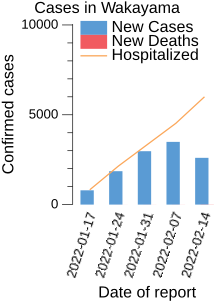
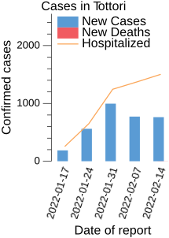
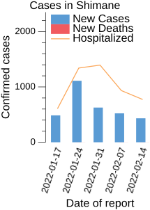
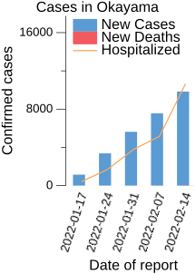
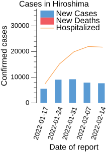
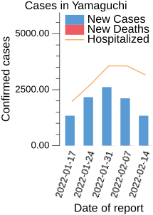
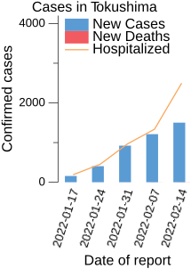
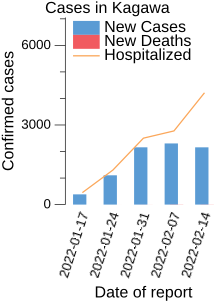
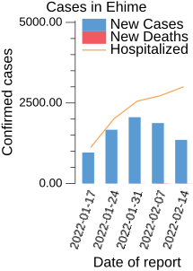
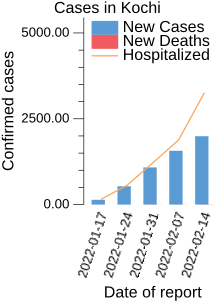
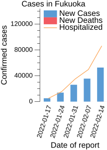
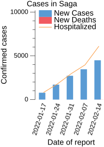
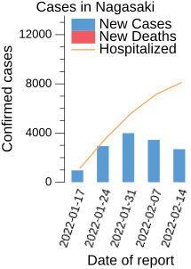
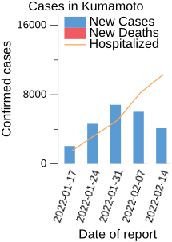
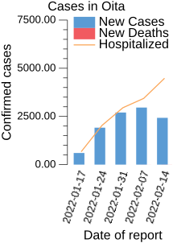

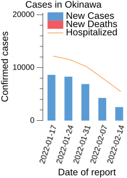

## 関連リンク

- [日本版 Google COVID-19 Forecast データを取得する Go パッケージを作ってみた](https://zenn.dev/spiegel/articles/20210214-cov19jpn)
