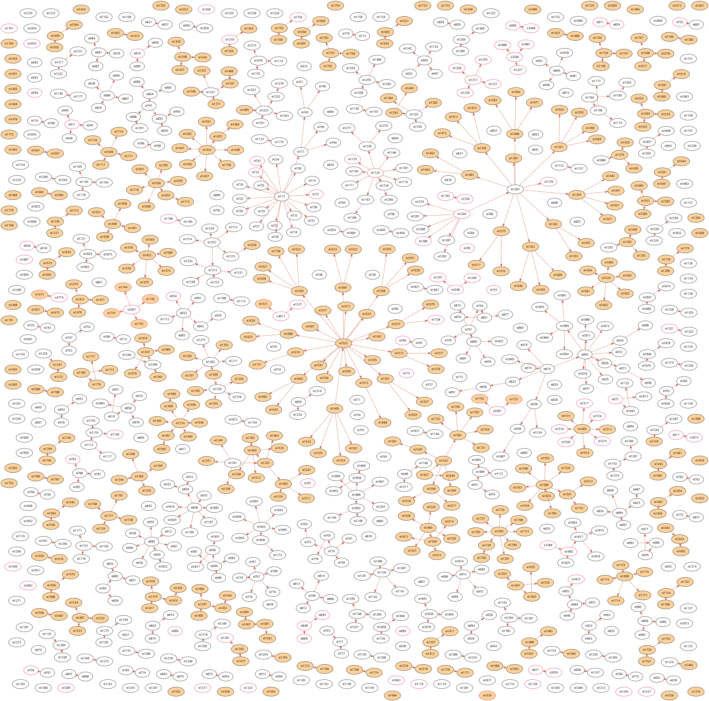

# 島根県松江市における SARS-CoV-2 感染者マップ

島根県松江市の COVID-2019 発症者の[発生状況]ページを元に  SARS-CoV-2 感染者マップを作ってみた。手作業による転記なのでミス等あると思うが，ご容赦のほどを。

- 2021年7月1日以降の[発生状況]報告をプロットしている
- 黒丸は松江市内在住者
- 赤丸は松江市外在住者または松江市外在住者からの二次感染者
- 背景が濃いものは直近1週間以内の松江市内在住の感染者

## 参考

- [松江市:暮らしのガイド:【まとめページ】新型コロナウイルス感染症について](http://www1.city.matsue.shimane.jp/kenkou/kenkoudukuri/kansensyo_yobou/coronavirus-disease/)
  - [新型コロナウイルス感染症患者等の状況](http://www1.city.matsue.shimane.jp/kenkou/kenkoudukuri/kansensyo_yobou/coronavirus-disease/koronajyoukyou.html)
  - [発生状況]
  - [コロナワクチン接種](http://www1.city.matsue.shimane.jp/kenkou/kenkoudukuri/kansensyo_yobou/coronavirus-disease/vaccine/)

[発生状況]: http://www1.city.matsue.shimane.jp/kenkou/kenkoudukuri/kansensyo_yobou/coronavirus-disease/coronahasseijoukyou.html "松江市:暮らしのガイド:発生状況"
