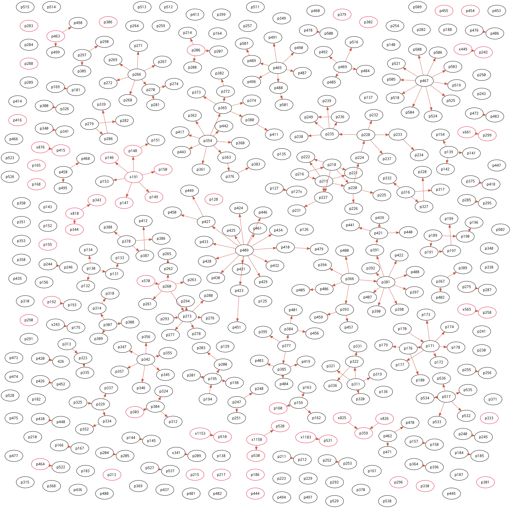

# 島根県松江市における SARS-CoV-2 感染者マップ

島根県松江市の COVID-2019 発症者の[発生状況](http://www1.city.matsue.shimane.jp/kenkou/kenkoudukuri/kansensyo_yobou/coronavirus-disease/coronahasseijoukyou.html)ページを元に  SARS-CoV-2 感染者マップを作ってみた。完全な手作業なので転記ミス等あると思うがご容赦。

- 黒丸は松江市内在住者
- 赤丸は松江市外在住者または松江市外在住者からの二次感染者
- 2020年10月25日報告分（125例目）からの報告をプロットしている

## 参考

- [松江市:暮らしのガイド:【まとめページ】新型コロナウイルス感染症について](http://www1.city.matsue.shimane.jp/kenkou/kenkoudukuri/kansensyo_yobou/coronavirus-disease/)
  - [新型コロナウイルス感染症患者等の状況](http://www1.city.matsue.shimane.jp/kenkou/kenkoudukuri/kansensyo_yobou/coronavirus-disease/koronajyoukyou.html)
  - [発生状況](http://www1.city.matsue.shimane.jp/kenkou/kenkoudukuri/kansensyo_yobou/coronavirus-disease/coronahasseijoukyou.html)
